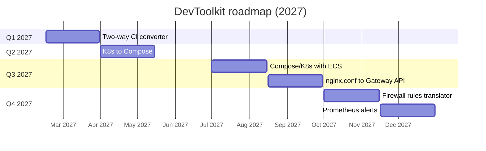

# Roadmap

DevToolkit builds converters that are **rare or missing elsewhere**. Tools found in many places already (Base64, JWT decoders, cron explainers and the like) are left to those places.

Features are listed in priority order and tracked on the [DevToolkit roadmap board](https://github.com/users/zainsohail88/projects/2/views/3). Dates are targets.

## Timeline

```mermaid
gantt
    title DevToolkit roadmap (2027)
    dateFormat YYYY-MM-DD
    axisFormat %b %Y

    section Q1 2027
    Two-way CI converter             :t1, 2027-02-15, 2027-03-31

    section Q2 2027
    K8s to Compose                   :t2, 2027-04-01, 2027-05-15

    section Q3 2027
    Compose/K8s with ECS             :t3, 2027-07-01, 2027-08-15
    nginx.conf to Gateway API        :t4, 2027-08-16, 2027-09-30

    section Q4 2027
    Firewall rules translator        :t5, 2027-10-01, 2027-11-15
    Prometheus alerts                :t6, 2027-11-16, 2027-12-31
```

## Planned

| Feature | What it does | Why it is needed |
|---------|--------------|------------------|
| **Two-way CI converter** | Any direction between GitHub Actions, GitLab CI, CircleCI, Jenkins (declarative) and Azure Pipelines | Existing tools convert one way only, into GitHub Actions |
| **Kubernetes → Docker Compose** | Deployments, Services, ConfigMaps → Compose services | No maintained tool goes this direction |
| **Compose / Kubernetes ↔ AWS ECS** | Both directions between Compose, Kubernetes and ECS task definitions | Existing tools are stale or cover Compose in part |
| **nginx.conf → Gateway API** | `server`/`location`/`proxy_pass` → `Gateway` + `HTTPRoute` | Existing tools start from Kubernetes Ingress |
| **Firewall rules translator** | Any direction between AWS Security Groups, GCP firewall rules, Azure NSGs and Kubernetes NetworkPolicy | No tool covers GCP or NetworkPolicy |
| **Prometheus alerts → Datadog / CloudWatch** | Prometheus alerting rules → Datadog monitors and CloudWatch alarms | No converter targets Datadog or CloudWatch |

Every converter follows the same rule as the existing ones: whatever it converts only in part is reported in `notes`. Each one gets a page in the web UI as well as an API endpoint.

## Later

- Ad-supported public hosting, from the original project vision. Revisit once the web UI has been live for a while.

## Done

- `converter-api` (FastAPI): Docker Compose to Kubernetes, YAML validation
- **AWS → Terraform** ([#9](https://github.com/zainsohail88/devtoolkit/issues/9)): CloudFormation (JSON/YAML), AWS SAM and AWS CDK (`cdk synth` output) to Terraform, with hand-written `aws` provider mappings for 85 common types and the `awscc` provider for the rest; CI checks the output with `terraform validate`. See [CloudFormation to Terraform](reference/cloudformation-to-terraform.md)
- `web` (FastAPI + Jinja2 + Tailwind): a page per tool, calls the API server-side; the API is reachable from `web` only
- Plain Kubernetes manifests: probes, resource limits, non-root, restricted Pod Security, NetworkPolicy
- CI: lint and house code rules, tests with a 95% coverage gate, Docker builds, manifest validation, Terraform validation, end-to-end on kind including the NetworkPolicy
- Image publishing to GitHub Container Registry, one image per service
- Dependabot, CodeQL, SHA-pinned actions

## Dropped

- **`utility-api`** (Base64, JWT decode, cron explain, hashing). These tools are widely available already, so building them would add clutter.

## Out of scope

The project leaves these to other tools:

- User accounts and authentication
- Database or persistent storage
- Rate limiting
- Paid features
- Mobile app
